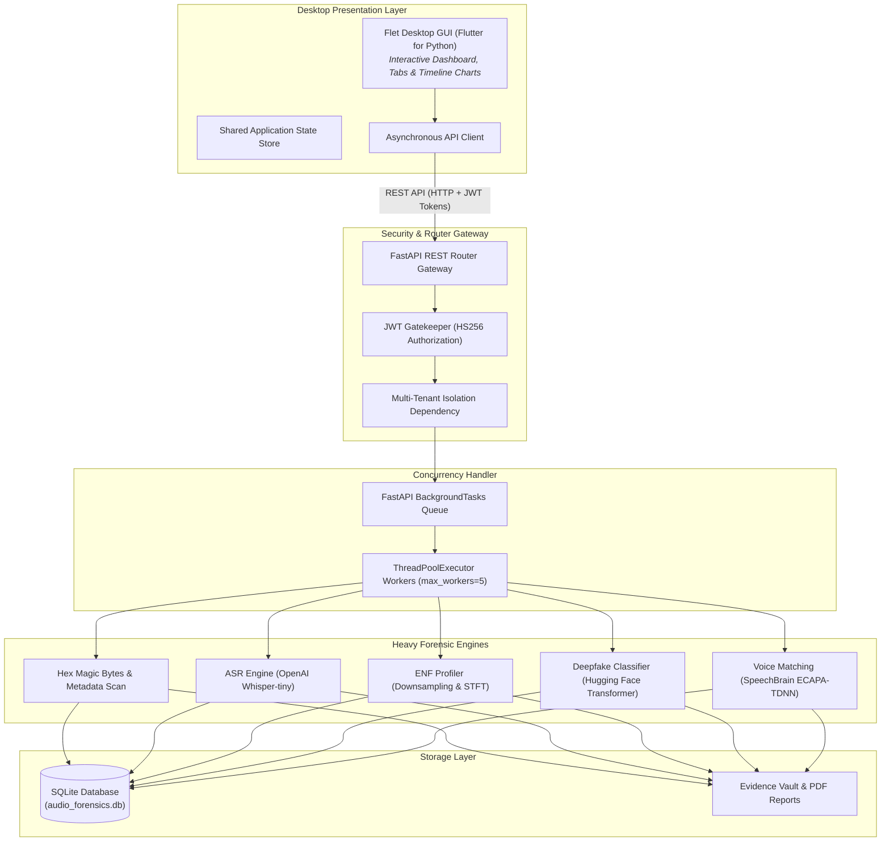

#  Salt & Pepper: Digital Audio Forensic Suite

[](https://www.python.org/)
[](https://flet.dev/)
[](https://fastapi.tiangolo.com/)
[](https://pytorch.org/)
[](https://huggingface.co/)
[](https://speechbrain.github.io/)
[](https://github.com/openai/whisper)
[](https://librosa.org/)
[](https://www.sqlite.org/)
[](https://en.wikipedia.org/wiki/SHA-2)
[](https://www.microsoft.com/windows)
[](LICENSE.txt)

**Salt & Pepper** is an advanced, integrated digital audio forensic suite designed for legal experts, law enforcement agencies, and forensic investigators. It provides a unified desktop interface to evaluate audio authenticity, detect AI deepfakes/voice clones, verify speaker identities, profile Electric Network Frequency (ENF) grid hums, inspect binary hex metadata, and generate court-admissible PDF forensic reports.

---

## 🌟 Key Features

- 🤖 **Production AI Deepfake Detection**: Employs the pre-trained Hugging Face transformer **`mo-thecreator/Deepfake-audio-detection`** (AutoModelForAudioClassification) utilizing dynamic `id2label` resample alignment, Log-Likelihood Ratio (LLR) scoring, sliding temporal segmentation (3.0s window, 1.0s stride), and a **65.0% mobile compression threshold** filter.
- 📊 **Custom Offline ML Benchmark Classifier (`KM-GBC`)**: Maintains a localized **KM-GBC** (Gradient Boosting Classifier) benchmark pipeline trained on a 96-dimensional acoustic fingerprint (40 MFCCs, 40 Deltas, 12 Chroma STFTs, 1 Centroid, 1 ZCR, 1 RMS, 1 Rolloff) with 300 estimators, max depth 4, learning rate 0.05, and subsample 0.8.
- 🇵🇰 **Proprietary Urdu Field Survey Dataset**: Integrated support for a custom benchmark dataset of **530+ local smartphone audio recordings** captured across noisy regional Pakistani environments, training `KM-GBC` to distinguish local dialects and low-cost microphone compression from AI fakes.
- 🗣️ **Deep Neural Speaker Verification (Voice Biometrics)**: Powered by SpeechBrain's **ECAPA-TDNN** architecture (`spkrec-ecapa-voxceleb`) to extract 192-dimensional vocal tract *x-vector* embeddings, evaluating speaker identity via Cosine Similarity with an elevated **0.45 forensic match threshold** and a **< 2.0s short audio penalty safeguard**.
- 📜 **Local Offline Speech-to-Text & NLP Audit**: Integrates a lazy-loaded `openai/whisper-tiny` ASR engine executing locally on CPU via `safe_load_audio` mono 16kHz memory buffers to transcribe speech and audit transcripts against normalized fraud watchlists (`WATCHLIST` & `SUSPICIOUS_PATTERNS`).
- ⚡ **Electric Network Frequency (ENF) Profiling**: Tracks 50 Hz / 60 Hz mains power grid micro-fluctuations to pinpoint physical audio splicing jumps or detect mathematically flat, synthetic AI sine wave signatures.
- 🔍 **Hexadecimal & Metadata Forensics**: Inspects raw magic byte signatures to detect file extension spoofing (e.g., MP3 renamed to WAV) and extracts embedded ID3/RIFF metadata tags.
- 📄 **Court-Admissible PDF Reports**: Automatically compiles cryptographically signed PDF forensic reports bound with SHA-256 chain-of-custody seals.
- 🖥️ **Modern Desktop GUI**: Built on Flet (Flutter for Python) with a high-contrast dark theme designed for low-light forensic workstations.

---

## 🏗️ System Architecture

Salt & Pepper strictly isolates presentation graphics from heavy deep learning and digital signal processing (DSP) workloads through a decoupled client-server model:



---

## 📁 Project Structure

```text
S&P/
├── backend/
│   ├── api/
│   │   └── routers.py           # API route handlers & concurrent ingestion
│   ├── core/
│   │   └── config.py            # App configurations & environment settings
│   ├── database/
│   │   ├── db.py                # SQLAlchemy engine & session management
│   │   └── models.py            # Relational database ORM schemas
│   └── services/
│       ├── ai_detection.py             # Deepfake classification & LLR scoring
│       ├── enf_profiling.py            # ENF downsampling & STFT variance analysis
│       ├── fingerprint.py              # Acoustic fingerprinting & pitch extraction
│       ├── forensics.py                # Hex magic bytes & Whisper STT scanning
│       ├── reporting.py                # Automated PDF report compiler
│       └── speaker_verification.py     # ECAPA-TDNN voice matching engine
├── frontend/
│   ├── assets/                  # App branding & iconography
│   ├── api_client.py            # Asynchronous HTTP API wrapper
│   └── main.py                  # Flet desktop application GUI
├── ml_artifacts/
│   ├── voice_model.pkl          # Trained Gradient Boosting benchmark model
│   └── training_metrics.json    # Benchmark performance metrics
├── scripts/
│   └── train_model.py           # Baseline model training script
├── audio_forensics.db           # SQLite database
├── start.py                     # Unified multi-process launcher
├── requirements.txt             # Python dependency manifest
└── README.md                    # Project documentation
```

---

## 🛠️ Installation & Setup

### Prerequisites
- **Python 3.10+**
- **Windows 10/11** (Recommended for Flet Win32 native taskbar integrations)

### 1. Clone the Repository
```bash
git clone https://github.com/HIXZI/salt-and-pepper.git
cd salt-and-pepper
```

### 2. Create & Activate Virtual Environment
```powershell
python -m venv .venv
.\.venv\Scripts\Activate.ps1
```

*(If script execution is disabled on PowerShell, run `Set-ExecutionPolicy -ExecutionPolicy RemoteSigned -Scope CurrentUser`)*

### 3. Install Dependencies
```powershell
pip install -r requirements.txt
```

### 4. Download spaCy Language Model
```powershell
python -m spacy download en_core_web_sm
```

---

## 🚀 Running the Application

### Option 1: Unified Launcher (Recommended)
Launch both the FastAPI backend and Flet desktop application concurrently with health-check monitoring and auto-restart capabilities:

```powershell
python start.py
```

### Option 2: Backend Server Only
To run only the REST API backend (accessible at `http://127.0.0.1:8000` with Swagger UI at `/docs`):

```powershell
python -m uvicorn backend.main:app --host 127.0.0.1 --port 8000 --reload
```

---

## ⚙️ Configuration

System settings can be configured via a `.env` file in the project root directory:

```env
API_HOST=127.0.0.1
API_PORT=8000
DATABASE_URL=sqlite:///./audio_forensics.db
UPLOAD_DIR=data/samples/
```

---

## 🎧 Supported Audio Formats

| Format | Extension | Notes |
| :--- | :--- | :--- |
| Waveform Audio | `.wav` | Uncompressed PCM |
| MPEG Audio Layer III | `.mp3` | Lossy compressed |
| Free Lossless Audio Codec | `.flac` | Lossless |
| Ogg Vorbis | `.ogg` | Open container format |
| Advanced Audio Coding | `.aac` / `.m4a` | Resilient decoding via embedded FFmpeg fallback |

---

## 📡 API Reference Summary

| Method | Endpoint | Description |
| :--- | :--- | :--- |
| `POST` | `/api/v1/upload` | Ingest audio file for full automated forensic analysis |
| `GET` | `/api/v1/evidence` | List evidence records bound to authenticated user |
| `GET` | `/api/v1/evidence/{id}` | Retrieve complete analysis telemetry for evidence ID |
| `POST` | `/api/v1/evidence/{id}/report` | Generate downloadable PDF forensic report |
| `POST` | `/api/v1/compare` | Execute biometric speaker comparison between two files |
| `DELETE` | `/api/v1/evidence/{id}` | Purge evidence record and file payloads |

---

## 👤 Author

- **Muhammad Salman Jawed**
[](https://hixzi.github.io/Portfolio/)
[](https://github.com/HIIXZI)
[](https://linkedin.com/in/hixzi)
[](mailto:salmanjawed2001@gmail.com)

---

## ⚖️ License

Copyright (c) 2026 **Muhammad Salman Jawed (Salt & Pepper)**. All Rights Reserved.  
See [LICENSE.txt](LICENSE.txt) for permission details.
